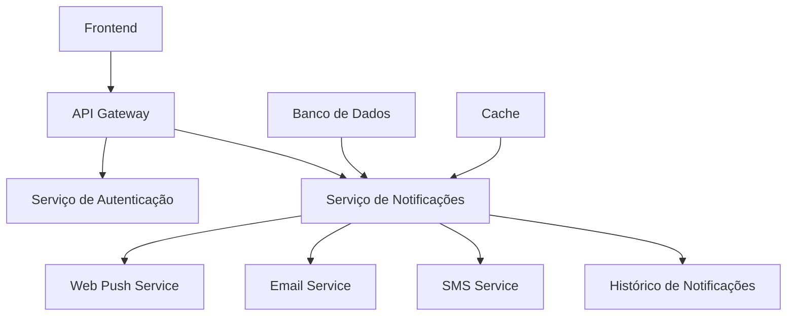

# Sistema de Notificação de Mensagens (Fullstack)

## 📋 Visão Geral

O Sistema de Notificação de Mensagens é uma plataforma centralizada que permite o gerenciamento e envio de notificações através de múltiplos canais (Web Push, E-mail e SMS). Desenvolvido para atender às necessidades de empresas e desenvolvedores que buscam uma solução unificada para suas comunicações digitais.

## 🎯 Objetivo

Criar uma ferramenta simples e eficiente para gerenciamento de notificações multi-canal, oferecendo uma API aberta para integração com qualquer plataforma externa.

## 🏗️ Arquitetura do Sistema



## 🚀 Funcionalidades

### 1. Configuração de Aplicativo
- Criação de aplicativos para integração
- Seleção e configuração de canais de notificação
- Gerenciamento de credenciais e configurações

### 2. Web Push
- Configuração de site e ícones
- Personalização de mensagens de permissão
- Notificações de boas-vindas
- Configuração de links de destino

### 3. E-mail
- Configuração de servidor SMTP
- Gerenciamento de templates HTML
- Configuração de remetente padrão
- Tracking de abertura de e-mails

### 4. SMS
- Integração com provedores de SMS
- Gerenciamento de credenciais
- Envio de mensagens em massa

### 5. Histórico de Notificações
- Visualização detalhada de envios
- Filtros por período e canal
- Exportação em PDF e Excel
- Tracking de status de entrega

### 6. Envio Manual
- Interface para envio pontual
- Seleção de audiência
- Personalização de mensagens
- Seleção de templates

## 🛠️ Tecnologias

### Frontend
- React.js
- TypeScript
- TailwindCSS
- Vite

### Backend
- Node.js
- Express
- TypeScript
- PostgreSQL
- Redis

### Infraestrutura
- Docker
- AWS/GCP
- CI/CD com GitHub Actions

## 📦 Instalação

1. Clone o repositório:
```bash
git clone https://github.com/seu-usuario/notify.git
cd notify
```

2. Instale as dependências:
```bash
yarn install
```

3. Configure as variáveis de ambiente:
```bash
cp .env.example .env
```

4. Inicie o projeto:
```bash
yarn dev
```

## 🔑 API

A documentação completa da API está disponível em `/docs/api`. Principais endpoints:

- `POST /api/applications` - Criar novo aplicativo
- `POST /api/notifications` - Enviar notificação
- `GET /api/history` - Consultar histórico
- `GET /api/templates` - Gerenciar templates

## 📝 Licença

Este projeto está sob a licença MIT. Veja o arquivo [LICENSE](LICENSE) para mais detalhes.

## 🤝 Contribuição

1. Faça um fork do projeto
2. Crie uma branch para sua feature (`git checkout -b feature/AmazingFeature`)
3. Commit suas mudanças (`git commit -m 'Add some AmazingFeature'`)
4. Push para a branch (`git push origin feature/AmazingFeature`)
5. Abra um Pull Request

## 📞 Suporte

Para suporte, envie um e-mail para suporte@notify.com ou abra uma issue no GitHub. 